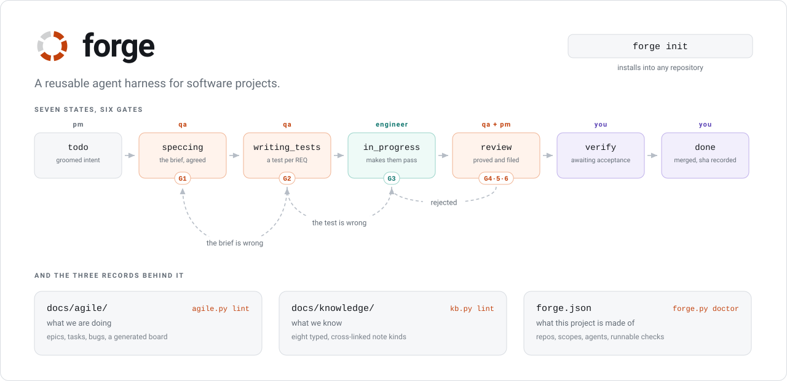

# forge

<picture>
  <source media="(prefers-color-scheme: dark)" srcset="assets/banner-dark.svg">
  
</picture>

[](https://www.npmjs.com/package/@vstlmkh/forge)
[](https://www.npmjs.com/package/@vstlmkh/forge)
[](LICENSE)
[](https://www.python.org/)
[](https://nodejs.org/)
[](package.json)
[](https://www.npmjs.com/package/@vstlmkh/forge?activeTab=code)

A reusable agent harness for software projects: a six-gate, specification-first
development cycle, a Markdown tracker, a typed knowledge base, role agents and
the hooks that keep all of it honest — installable into any repository in one
command.

## Install

```bash
npx @vstlmkh/forge init --auto      # no install at all
npm install -g @vstlmkh/forge       # or keep `forge` on your PATH
```

The npm package is a shim: the CLI itself is Python 3.9+ with no dependencies,
exactly like the harness it installs. Node 16+ is only there to carry it.

Prefer no npm in the loop? The shell installer puts one git checkout in
`~/.forge` and one `forge` shim in `~/.local/bin`:

```bash
gh api repos/vstlmkh/forge/contents/install.sh -H "Accept: application/vnd.github.raw" | sh
```

or, if you would rather clone first:

```bash
git clone https://github.com/vstlmkh/forge.git ~/.forge && ~/.forge/install.sh
```

The repository is **private**, which rules out the usual
`curl … raw.githubusercontent.com/… | sh`: raw URLs do not see your git
credentials and answer 404. `gh api` authenticates over the API, and a plain
`git clone` over https works through whatever credential helper already holds
your token. Once the repository is public, the short form works too:

```bash
curl -fsSL https://raw.githubusercontent.com/vstlmkh/forge/master/install.sh | sh
```

Re-run the installer any time to update, or run `forge self-update` — which
knows whether it is looking at a git checkout or an npm install and says the
right thing for each. `FORGE_HOME`, `FORGE_BIN`, `FORGE_REF` and `FORGE_REPO`
override where it lands, which ref it tracks and where it clones from.

**On a machine with several GitHub accounts**, `gh repo clone` and
`git@github.com:…` both fail with *Repository not found*: they use the default
ssh key, which belongs to another account. The installer handles it — it tries
https, then `git@github.com`, then every `Host` alias in `~/.ssh/config` whose
`HostName` is `github.com`, and tells you which one worked. Nothing ever waits
on a credential prompt, so piping it into `sh` cannot hang.

## Use it in a project

```bash
cd /path/to/your/project
forge detect        # what forge thinks this repository is made of
forge init --auto   # install the harness from exactly that, asking nothing
```

Every command works through `npx @vstlmkh/forge …` just as well, if you would
rather not install anything.

`detect` reads `.gitmodules`, then looks for `package.json`, `pyproject.toml`,
`composer.json`, `go.mod`, `Cargo.toml` and `pubspec.yaml` — including one level
inside a submodule, where deployment repositories usually keep the application.
Out of that come the repositories, the scopes, a stack label and the real test,
lint, type and build commands the project already has. It guesses that those
commands work; `forge doctor` and you decide whether they do.

`forge init` without `--auto` asks instead — it still opens with what it
detected, so the usual answer is "yes, that's right".

Either way it writes `forge.json`, copies the harness into `.claude/`, scaffolds
`docs/agile/` and `docs/knowledge/`, renders one engineer agent per scope, and
adds a managed block to your `CLAUDE.md`. Nothing else in the project is
touched.

## What you get

| Piece | What it is |
|---|---|
| `docs/agile/` | backlog, task tracker and bug tracker as Markdown with YAML frontmatter; `INDEX.md` is generated |
| `docs/knowledge/` | eight-type knowledge base — business rules, incidents, decisions, contracts — with a generated coverage index |
| `.claude/agents/` | `pm`, `qa`, and one engineer per code scope |
| `.claude/skills/` | the operating rules: artifacts, grooming, git, Definition of Done, knowledge |
| `.claude/commands/` | `/agile:*`, `/kb:*`, `/forge:doctor` |
| `.claude/scripts/` | `agile.py`, `kb.py`, `forge.py` and four hooks — stdlib-only Python 3, no dependencies |
| `forge.json` | **the only project-specific file**: repositories, scopes, owning agents, and the Definition-of-Done matrix |

## The cycle it enforces

Four properties are load-bearing, and all four are checked by a script rather
than trusted:

- **Test-first.** `qa` writes a failing test per acceptance criterion and proves
  it red *before* an engineer starts. There is no `todo -> in_progress`.
- **The tests are not the implementer's.** At the review gate `qa` diffs the test
  files against its own red commit; a loosened matcher or a deleted assertion is
  a rejection.
- **Nobody closes their own work.** An engineer stops at `review`, `qa` moves it
  to `verify`, and only the top-level session sets `done`.
- **A gap is named, not hidden.** `SKIPPED`, `NO-TEST` and `NO-DOCS` are the
  three waivers; each one must name what it falls back on, and `lint` refuses a
  ticket that reaches review having recorded neither a note nor a reason.

## Everything project-specific lives in `forge.json`

```jsonc
{
  "repos":  { "backend": { "path": "backend", "branch": "master", "submodule": true } },
  "scopes": { "backend": { "repo": "backend", "agent": "backend-engineer",
                           "kb_scope": "backend", "stack": "Laravel 11",
                           "workdir": "backend/app" } },
  "checks": { "backend": [ { "id": "tests", "command": "composer test",
                             "cwd": "backend/app", "available": true } ] }
}
```

The scripts, skills, agents and commands read it; none of them hardcode a scope,
a branch or a command. That is what makes the same harness fit a one-repository
service and a super-repo with submodules, and what lets the Definition-of-Done
matrix tighten itself: when a bootstrap ticket makes `mypy` real, flipping
`"available": false` to `true` is part of that ticket's acceptance criteria.

```bash
python3 .claude/scripts/forge.py scopes        # who implements what, and where
python3 .claude/scripts/forge.py checks api    # the matrix qa is bound by
python3 .claude/scripts/forge.py doctor        # does the config match the repo?
```

## Commands in a project that has the harness

```
/agile:board            what is going on
/agile:groom <request>  turn a request into tickets
/agile:next             what to work on
/agile:work <ID>        the six gates: spec → tests → implement → validate → document → board
/agile:close <ID>       merge, record the sha, close
/agile:bug <symptom>    file and triage a defect

/kb:consult <subject>   what do we already know?
/kb:new <finding>       file it, correctly typed and cross-linked
/kb:audit               gaps, misfilings, staleness, broken links
/forge:doctor           does the harness still match the repository?
```

## CLI

```
forge detect [TARGET]    print the shape forge infers, and change nothing
forge init [TARGET]      install — interactively, or --auto, or --preset NAME
forge agents [TARGET]    re-render the per-scope engineer agents from forge.json
forge upgrade [TARGET]   refresh scripts, skills, commands and specs in place
forge doctor [TARGET]    run the installed harness's self-check
forge self-update        pull the newest forge into ~/.forge
forge where              print where forge is installed
```

`upgrade` never touches `forge.json` except to record a policy a new gate needs,
leaves the per-scope engineer agents alone (pass `--agents` to re-render those
too), and rewrites only the `<!-- forge:begin -->` block in `CLAUDE.md`. Running
it twice leaves a zero diff.

## Repository layout

```
forge/
├── install.sh             clones into ~/.forge and links the shim; re-run to update
├── package.json           the npm package: @vstlmkh/forge
├── bin/forge              the CLI: detect, init, agents, upgrade, doctor
├── bin/forge.js           the npm shim that runs it
├── assets/banner.py       regenerates the two README banners
├── template/              the payload that gets copied into a project
│   ├── .claude/           agents, skills, commands, scripts, settings
│   ├── docs/              the tracker and knowledge-base specifications
│   ├── CLAUDE.harness.md.tmpl
│   └── forge.example.*.json
├── docs/                  how the harness works and how to extend it
├── tests/smoke.sh         installs into a throwaway repo and proves every gate fires
├── CONTRIBUTING.md        how to file an issue and how to change forge itself
└── LICENSE                MIT
```

## Requirements

Python 3.9+ and git — plus Node 16+ only if you install through npm, which uses
it for nothing but the shim. No third-party packages, at install time or
afterwards —
the hooks run on every turn, so the harness refuses to own a dependency tree.
Updating forge never touches a project: a project picks up a new version when
you run `forge upgrade` in it.

## Tests

```bash
tests/smoke.sh
```

Installs into a temporary repository, files a ticket and a note through the
scripts, and asserts that each gate fires: the docs gate, the knowledge-base
naming guard, the generated-index guard, the byte-stability of both indexes, and
the one-working-tree rule.

## Attribution

forge signs the files it generates — the two `INDEX.md` boards, the managed
`CLAUDE.md` block, the rendered engineer agents — with one line and a link:

```markdown
_Kept by [forge](https://github.com/vstlmkh/forge)._
```

It signs nothing else. Not a commit, not a pull request, not a ticket, not a
knowledge-base note, not a file anyone on the project wrote. The line is plain
visible text, because the only honest mark to leave in somebody else's
repository is one they can read and delete — and a hidden one in a client
codebase is a liability for whoever installed it.

Turn it off entirely with `forge init --no-attribution`, or later:

```jsonc
{ "attribution": false }     // in forge.json; regenerate and every instance is gone
```

```bash
python3 .claude/scripts/forge.py credit   # what this project signs with, if anything
```

## Contributing

Issues and pull requests are welcome —
[CONTRIBUTING.md](CONTRIBUTING.md) is the whole of it. The short version:

- **a bug** is `forge where`, `forge version`, `forge detect .` and the shortest
  reproduction that still fails — in a throwaway repository, never a paste of a
  private one;
- **a stack forge does not recognise** is the cheapest contribution there is:
  one `_<lang>_checks()` function and one `MANIFESTS` entry in `bin/forge`,
  plus an assertion in `tests/smoke.sh`;
- **a new rule** has to name the failure it prevents, because every rule under
  `template/` is one an agent obeys in somebody else's repository forever;
- **nothing in `template/` may name a project, a stack, a branch, a scope or a
  command** — that is what keeps the payload identical everywhere and
  `forge upgrade` safe;
- **`tests/smoke.sh` has to pass**, and new behaviour needs a new assertion in
  it. A gate nobody tests is a gate that silently stops firing.

Before asking for a feature, check whether it is already a
[`forge.json` edit](docs/customizing.md) — most of them are. If it genuinely
cannot be expressed there, that is the feature request worth filing.

Security issues go to <uladzislau.stelmakh@mobyrix.com>, not to the tracker.

## License

MIT — see [LICENSE](LICENSE).

That covers everything under `template/` too, so the harness a project installs
carries the same terms. Installed files get no licence header: they land in
someone else's repository, and a per-file banner there would be noise.
